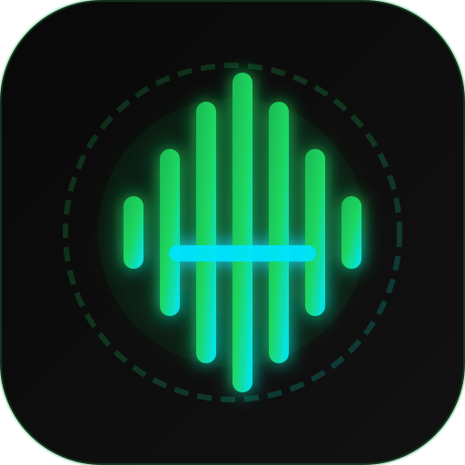

# AuraMusic 🎵

<p align="center">
  
</p>

<p align="center">
  <b>Unlimited, 100% Ad-Free Real-Time Music Streaming App for Android & Web</b>
</p>

<p align="center">
  
  
  
  
  
</p>

---

## 🌟 Key Features

- **🎧 100% Free & Ad-Free Music**: Unlimited streaming of any track worldwide without audio ads, video popups, or subscription paywalls.
- **⚡ High-Fidelity Audio**: Real-time direct streaming up to **320 kbps** with full browser CORS support and native Android playback.
- **🎤 Synchronized Karaoke Lyrics**: Timestamped real-time lyrics that scroll dynamically and allow one-tap seeking to any lyric line.
- **📱 Android Background Service & MediaSession**: Lock-screen notification player with interactive seekbar, play/pause, next/prev, and high-res cover art.
- **🖥️ Adaptive Device-Decorated UI**:
  - **Desktop / Web**: Left navigation sidebar rail, full-width bottom player with volume slider, scrubber, and slide-out side panels.
  - **Mobile / Android**: Floating frosted glass MiniPlayer with swipe-to-skip gestures and expandable full-screen player with dynamic album art gradient glow.
- **📥 1-Tap Offline Downloader**: Save songs locally with cover art for 100% offline listening without internet.
- **📻 Infinite Auto-Radio**: Automatically finds and queues matching tracks when your playlist ends.
- **🎨 Custom Theming**: AMOLED True Black and Spotify Midnight themes.

---

## 📁 Repository Structure

```
auramusic/
├── LICENSE                                           # MIT License
├── README.md                                         # Project Documentation
├── assets/
│   └── logo/
│       └── logo.svg                                  # High-resolution vector logo
├── lib/
│   ├── main.dart                                     # App initialization & entry point
│   ├── models/                                       # Song, Playlist, Artist, Lyrics
│   ├── services/                                     # MusicService, LyricsService, AudioPlayerService, StorageService, DownloadService
│   ├── providers/                                    # PlayerProvider, ExploreProvider, LibraryProvider, SettingsProvider
│   ├── screens/                                      # MainShell, Home, Search, Library, Settings, Player
│   └── widgets/                                      # AuraLogo, DesktopPlayerBar, DesktopSidebar, MiniPlayer, SongTile
└── test/                                             # Automated integration and widget test suite
```

---

## 🚀 Installation & Running

### 1. Android Phone Installation (Production Release)
Download and install the APK on your phone:
- [`app-release.apk`](file:///C:/Users/iampr/.gemini/antigravity/scratch/auramusic/build/app/outputs/flutter-apk/app-release.apk) (25.3 MB)

### 2. Run on Web / Browser
```bash
flutter run -d chrome
```
Or view the live web server running at [http://localhost:8080](http://localhost:8080).

---

## 📄 License

This project is licensed under the [MIT License](LICENSE) - see the [LICENSE](LICENSE) file for details.
